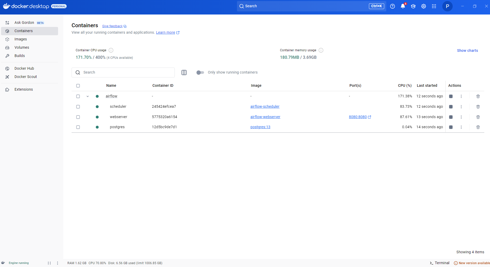
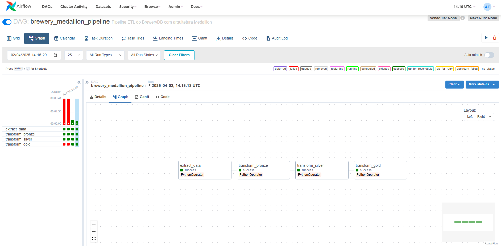
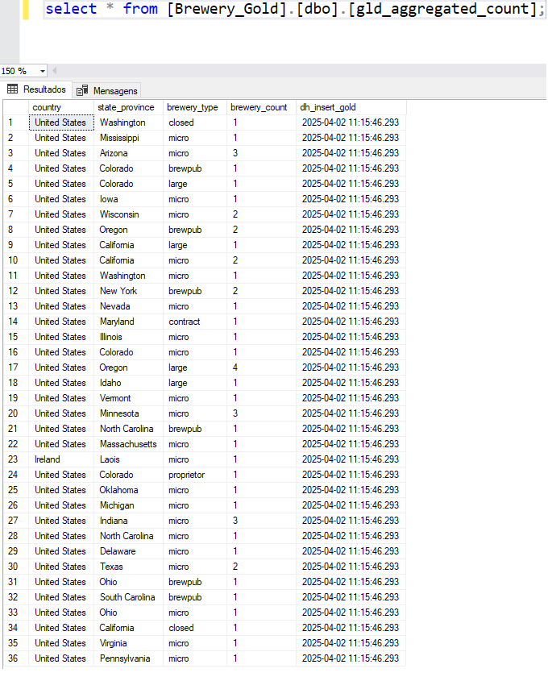

# Imagens do Projeto Brewery Medallion

Este diretório contém as imagens utilizadas para ilustrar e documentar visualmente o fluxo de dados do projeto Brewery Pipeline.

## Imagens disponíveis

### Diagrama do Pipeline
- `docker_airflow_containers.png`: Imagem do ambiente Docker utilizado no projeto, com destaque para os containers responsáveis pela execução do Apache Airflow.

---

### Execução no Airflow
- `airflow_executions.png`: Imagem destacando as execuções do pipeline realizadas via Apache Airflow.

---

### Resultado Gold no SQL Server
- `gld_aggregated_count_table_sql_server.png`: Imagem do resultado final da extração, armazenada em uma tabela no banco de dados SQL Server.

